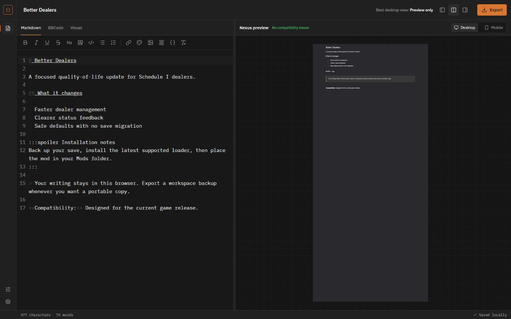
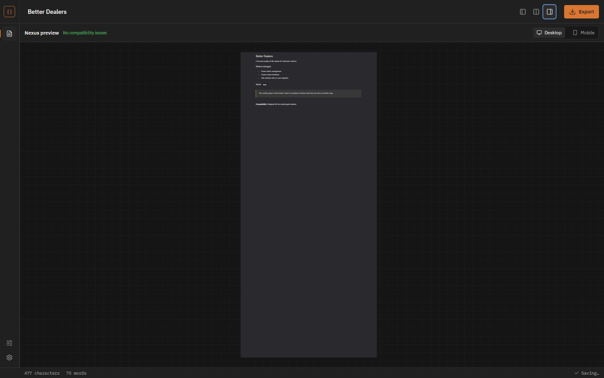
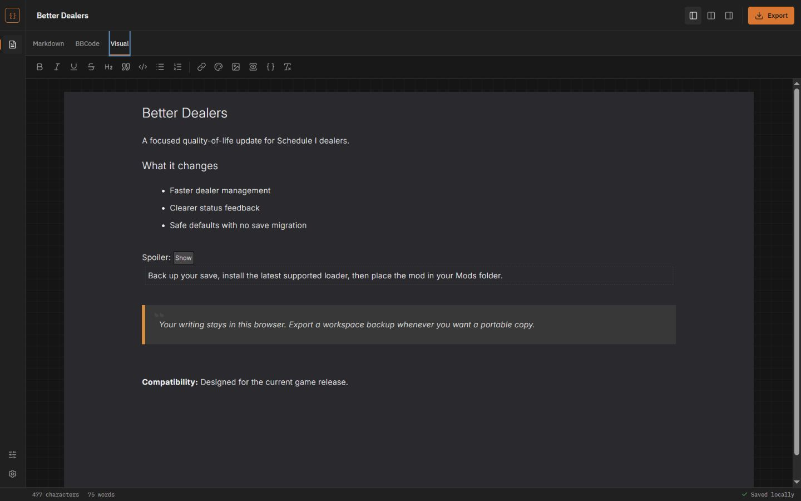
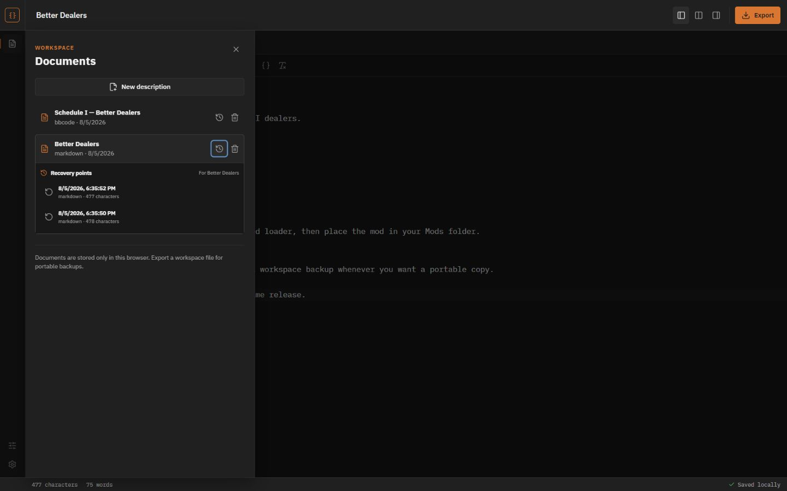
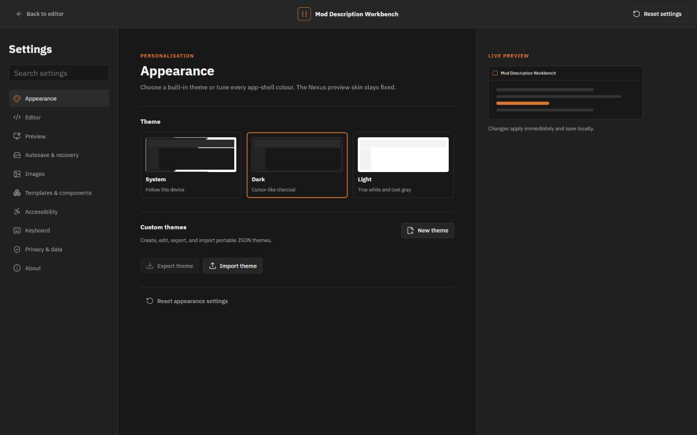
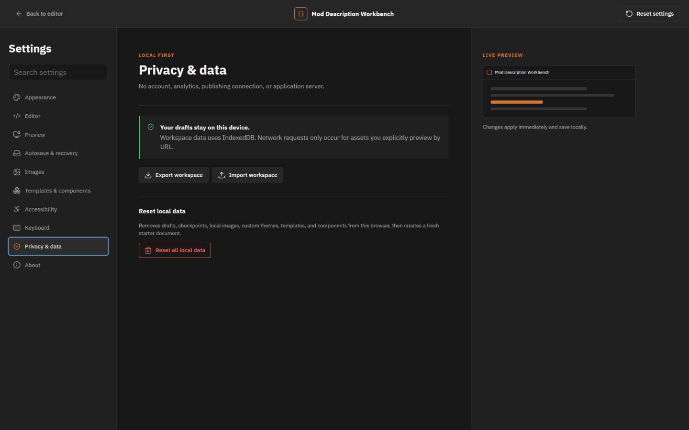
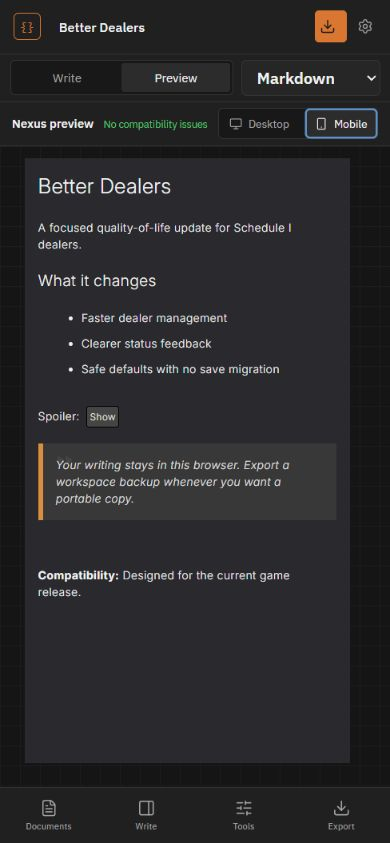
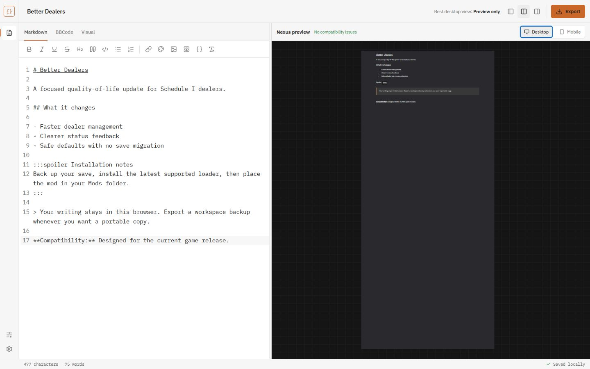

# Mod Description Workbench

Write your mod description locally, preview how it will look on Nexus Mods, then copy the finished BBCode when you are ready.

[Open Mod Description Workbench](https://ifbars.github.io/mod-description-workbench/)

Your drafts stay in your browser. There is no account, backend, analytics service, or cloud document storage behind the app.



> [!NOTE]
> Mod Description Workbench is an independent tool. It is not affiliated with or endorsed by Nexus Mods, and it never edits or publishes a mod for you.

## Why this exists

Writing a long description directly in a website editor is risky. A failed save, expired session, or outage can take the only copy with it.

Mod Description Workbench keeps the working copy on your device and makes the final Nexus submission a manual last step. You can write in Markdown, BBCode, or the visual editor without giving up a live Nexus-style preview.

## How to use it

1. Create a document and choose Markdown, BBCode, or Visual.
2. Write in split view, or switch to Preview only for the clearest desktop comparison.
3. Check the desktop and mobile previews.
4. Open **Export** and copy or download the Nexus BBCode.
5. Paste it into the Nexus description editor and review it there before saving.

The app autosaves after you stop typing. Each document has its own recovery points, which you can restore from the Documents panel.

## What you get

- Markdown and Nexus-flavoured BBCode source editors
- A visual editor backed by canonical BBCode
- Matching preview output across all three authoring modes
- Desktop and mobile Nexus-style previews
- Split, editor-only, and preview-only layouts
- Local documents, autosave, and recovery points
- Portable `.mdw` workspace backups, including local image files
- BBCode copy plus Markdown, BBCode, HTML, and plain-text downloads
- BBCode autocomplete, formatting controls, colour picker, spoiler builder, and image library
- Reusable templates and components
- Light, dark, system, and custom themes
- Compatibility warnings for unsupported or lossy content

## More screenshots

<details>
<summary>Preview-only desktop view</summary>

Preview only gives the desktop canvas enough room to render at its intended size.



</details>

<details>
<summary>Visual editor</summary>

The visual editor uses the same Nexus-style typography and blocks as the preview while keeping BBCode as the canonical source.



</details>

<details>
<summary>Documents and recovery points</summary>

Each document owns its recovery history. Workspace backups remain available when you need a copy outside the current browser profile.



</details>

<details>
<summary>Appearance and custom themes</summary>

App themes change the surrounding workbench. The Nexus preview remains fixed so a theme cannot distort compatibility checks.



</details>

<details>
<summary>Local data controls</summary>

Settings keeps workspace export, import, and reset controls together.



</details>

<details>
<summary>Mobile preview</summary>

The compact layout keeps writing and previewing separate so neither surface gets squeezed into an unusable split.



</details>

<details>
<summary>Light workbench theme</summary>

The light theme uses a white editor surface while preserving the measured Nexus preview appearance.



</details>

## Local data and backups

The app stores documents, recovery points, themes, templates, components, and image metadata in IndexedDB. It keeps small preferences in `localStorage`.

Clearing site data or removing the browser profile can remove that workspace. Export an `.mdw` workspace file when you want a portable backup. The bundle includes private local image blobs as well as the document library.

Remote images load only from URLs you add. A local image remains preview-only until you replace it with a public URL that Nexus can access.

## Nexus compatibility

The preview renderer uses manually captured Nexus editor and public-page fixtures. It covers the BBCode, spacing, typography, quotes, lists, spoilers, links, images, and responsive layout exercised by those fixtures.

Nexus can change its editor or public styles at any time. Treat the local preview as a close compatibility check, not a replacement for reviewing the final description on Nexus.

The app does not log in to Nexus, scrape pages, save descriptions, or publish mods.

## Run locally

Install [Bun](https://bun.sh/), then run:

```powershell
bun install
bun run dev
```

Create a production build with:

```powershell
bun run build
```

## Tests

The project has unit, component, persistence, parser, conversion, accessibility, desktop, and mobile coverage.

```powershell
bun run lint
bun run typecheck
bun run test
bun run test:e2e
bun run build
```

## Deployment

The included GitHub Actions workflow tests the app, builds the static site, and deploys `dist/` to GitHub Pages after a push to `main`.

The production build uses `/mod-description-workbench/` as its Pages base path. Change the Vite base if the repository name changes.

## Contributing

Bug reports and focused pull requests are welcome. For preview mismatches, include the BBCode source, browser size, Nexus appearance, and screenshots of both renderers when possible.

Please keep Nexus interaction manual. Compatibility work should not automate editing, saving, scraping, or publishing on Nexus Mods.
